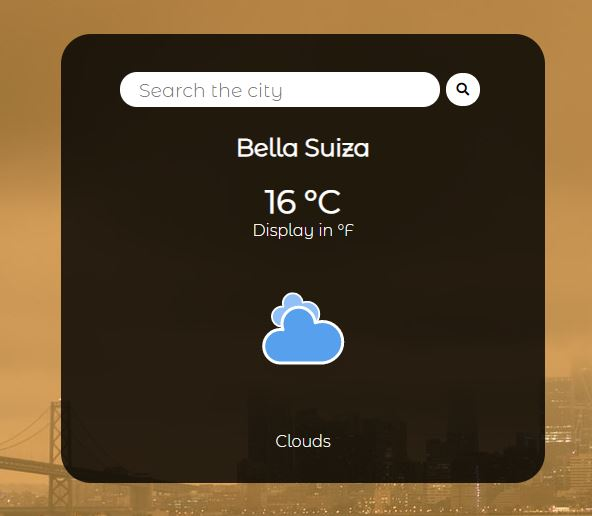

# weather-js

This is a weather app that was created with HTML and Javascript,
This weather app shows you the current weather in your place and also you can search for a different city.

## Live demo

[live demo](https://rawcdn.githack.com/BrianSammit/weather-js/e9c30fb63ddb7a60737c81565fcbd3b7f46a6e6d/dist/index.html)

## Built With

- JavaScript
- HTML
- SCSS
- Webpack
- Package.json

## How to start the project from your Local enviroment

- Open your terminal and cd where you want to store the project
- Run the following command - `git clone https://github.com/BrianSammit/weather-js.git`
- Cd into the directory - `cd weather-js`
- Open the live server on your VScode `Alt + L` then `Alt + o` in the index.html

## Author

👤 **Brian Cruz**

- Github: [@githubhandle](https://github.com/BrianSammit)
- Twitter: [@twitterhandle](https://twitter.com/cruzsammit)
- Linkedin: [linkedin](https://www.linkedin.com/in/brian-sammit-cruz-rodriguez-5877551a8/)

## 🤝 Contributing
